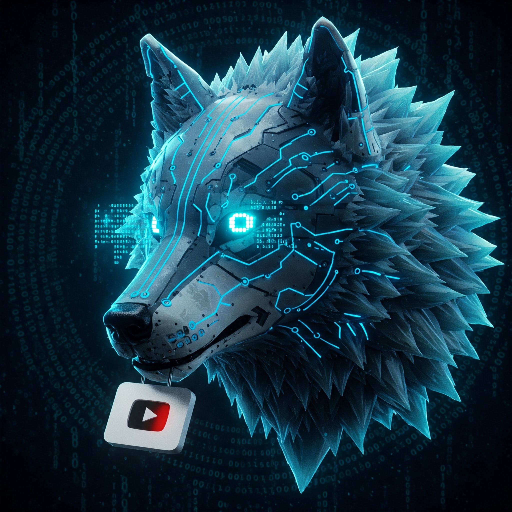
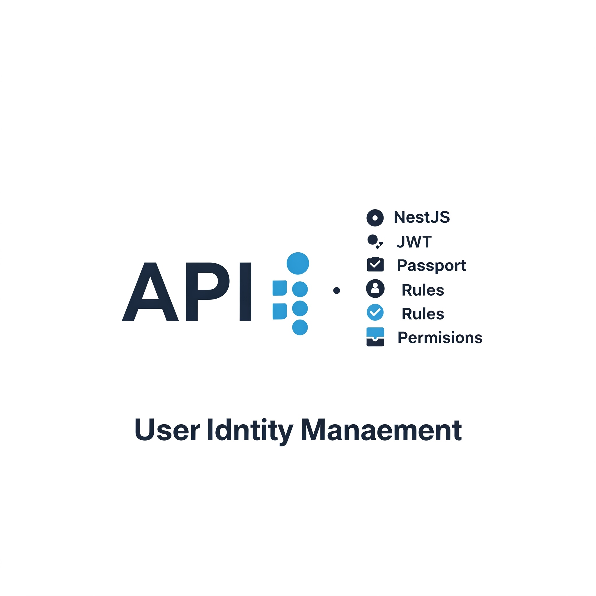
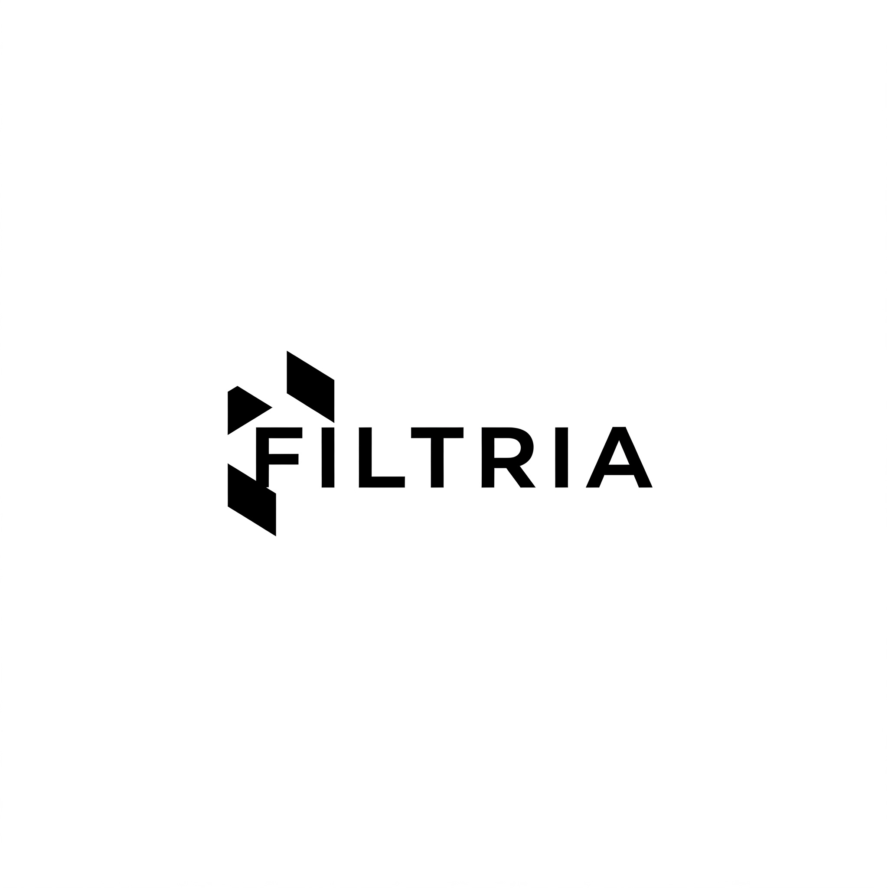

# 👋 Olá, eu sou Marinho! 

*Bem-vindo ao meu perfil do GitHub! Sou um entusiasta da tecnologia, apaixonado por desenvolvimento de software, automação e soluções inovadoras. Aqui você encontrará alguns dos meus projetos, contribuições e experimentos. Fique à vontade para explorar e entrar em contato!*

---

## 🚀 Sobre Mim

- 💻 Desenvolvedor com foco em **Python**, **JavaScript** e **Automação**.
- 🛠️ Amante de ferramentas de produtividade e workflows eficientes.
- 🌱 Sempre aprendendo e explorando novas tecnologias.
- 📚 Compartilho conhecimento através de tutoriais e projetos open-source.
- 🎯 Objetivo: Criar soluções inteligentes e que simplifiquem a vida das pessoas.

---

## 🛠️ Tecnologias e Ferramentas

Aqui estão algumas das tecnologias e ferramentas que utilizo no meu dia a dia:

**Banco de Dados**  
   

**CI**  

**Sistemas Cloud**  
 

**Ferramentas de Colaboração**  
   

**Frameworks**  
       

**ORM**  
  

**O.S.**  
   

**Linguagem de Programação**  
            
 
---

## 🌟 Projetos Destacados

Aqui estão alguns dos meus projetos mais interessantes:

### 🚀 [Ariska](https://github.com/byMarinho/ariska)

   
    
    

        
API para extração de áudio e vídeo do Youtube

        
Frontend desenvolvido em Streamlit

        
<strong>Tecnologias utilizadas:</strong> Python, Streamlit, FastAPI e Docker

    

### 🚀 [IAM](https://github.com/byMarinho/apiiam)

    
    

        
API para Gerenciamento de Identidade e Acesso

        
<strong>Tecnologias utilizadas:</strong> Typescript, NestJS, TypeORM, Scalar Doc, Jest, PostgreSQL

    

### 🚀 [Filtria](#)

    
    

        
API que Aplica Filtro na Imagem

        
Frontend desenvolvido em Streamlit

        
<strong>Tecnologias utilizadas:</strong> Selenium, GitHub Actions

    

---

## 📊 Estatísticas do GitHub

  

## 🎥 Bem-Vindos

*Sinta-se à vontade para explorar meus projetos e contribuições!*

## 📫 Como Entrar em Contato

- 
- 
- 

---

## 🤝 Vamos Colaborar!

Se você tem uma ideia interessante, quer colaborar ou precisa de colaboração em algum projeto, sinta-se à vontade para entrar em contato. Amo trabalhar em equipe, trocar aprendizado e criar coisas incríveis juntos!

---

⭐️ Se você gostou do que viu aqui, não se esqueça de deixar uma estrela nos repositórios que achou interessantes! Obrigado pela visita! 😄